# Streamify 🎬

**A movie watching web application to explore, watch, and interact with movies.**

---

## Features

### Home Page

- Browse **trending movies**, **popular movies**, and **recently viewed movies**
- "**View More**" option for each category

### Movie Details Page

- Click on a movie to open a detailed page showing:
  - **Description**
  - **Genre**
  - **Cast**
  - **Similar movies**
  - **Watch trailer**

### Movie Interaction

- **Watch movie** (currently redirects to external link — note: insecure link)
- **Add comments** on movies
- **Comment reactions** (like/dislike)

### Favorites

- **Add movies to favorites**
- **Remove movies from favorites**
- **View favorite movies listing**

---

## Setup / Clone Project

1. Register an account on [TMDB](https://www.themoviedb.org/?language=vi)
2. Clone the repository:
   ```bash
   git clone https://github.com/your-username/streamify.git
   cd streamify
   ```
3. Install dependencies:
   npm install
4. Copy .env.example to .env and fill in your API keys:
5. Start the development server:
   npm start

### Clone project

- Register an account on [TMDB](https://www.themoviedb.org/?language=vi)
- In file .env.example fill the environment variable match then rename to .env

### ScreenShots

### 🔐 Login Page

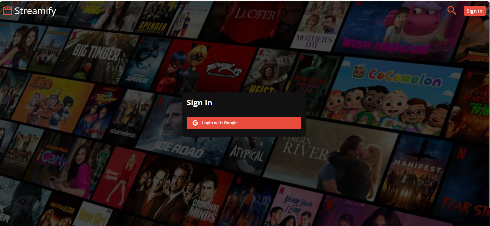

### 🏠 Home Page

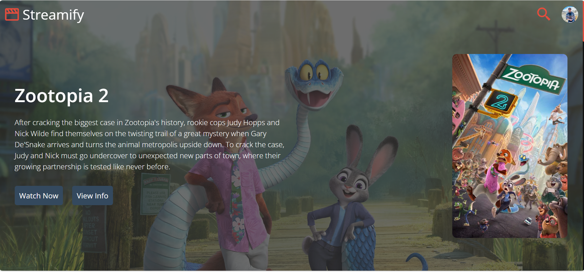

### 🔍 Search Page

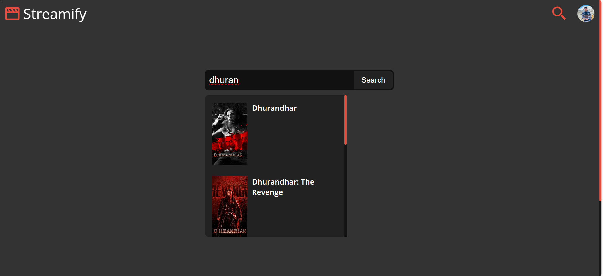

### 🎬 Movie Section

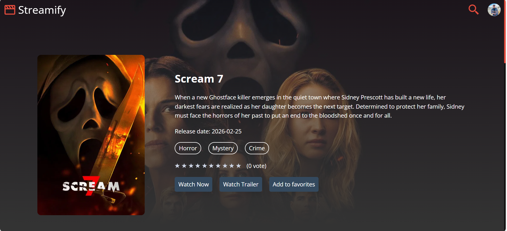

### 🎭 Movie Categories

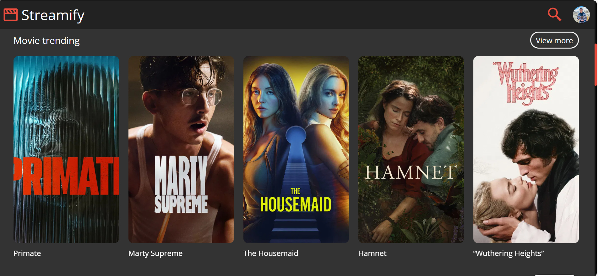

### 🎭 Movie Categories (More)

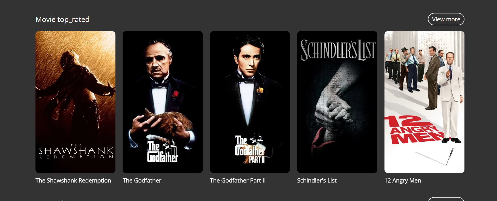

### 👥 Movie Cast

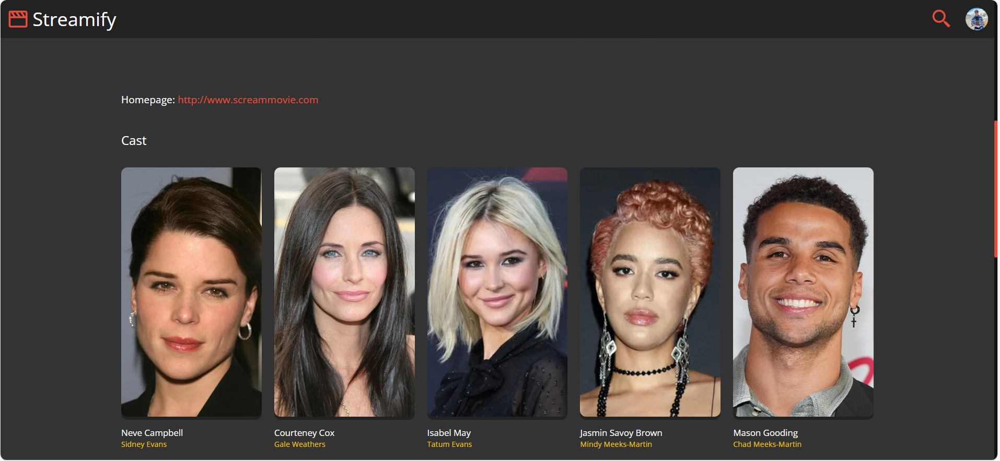

### 🎞 Trailers

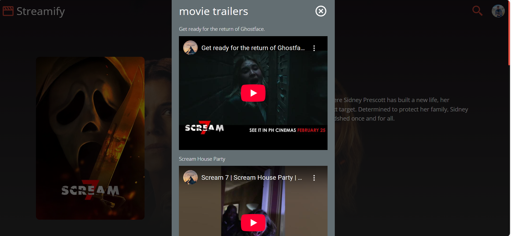

### ▶ Watch Now

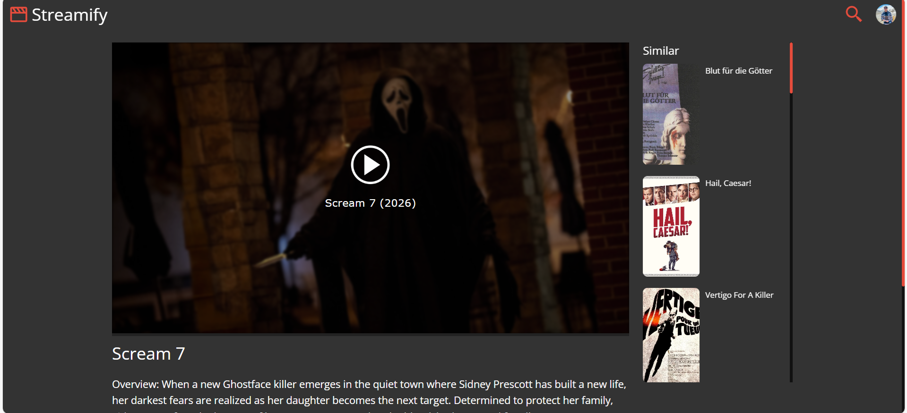

### 💬 Comments

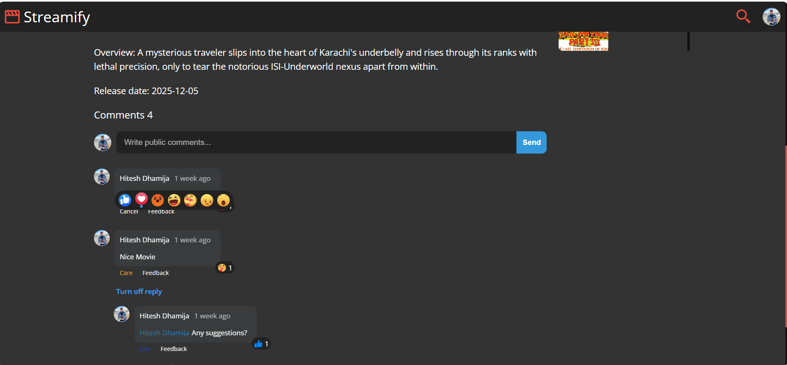

### ❤️ Favourite Movies

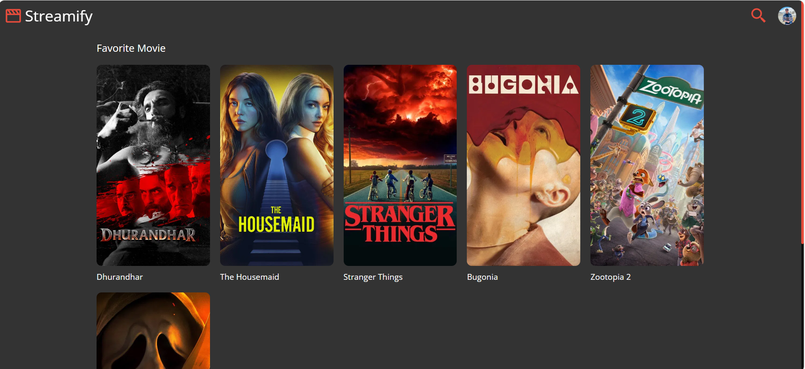

### Technology

- FE: ReactJs, Redux Toolkit, Swiper, Javasrcipt
- BE: Firebase (Authentication, Firestore database)
- APIs: TMDB API
